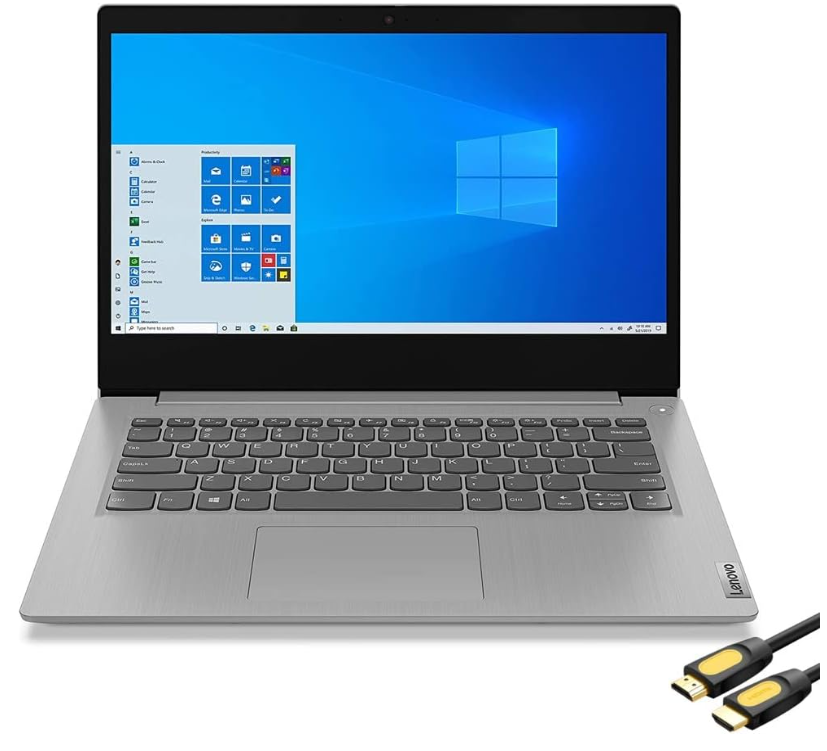
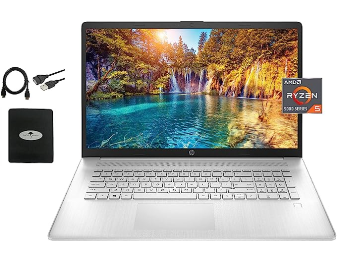

# Recommendation

*This site is compares three laptops, two to replace the one that will be supplied to the company.*

### Lenovo Ideapad

[Click here to view](https://www.bestbuy.com/site/lenovo-ideapad-1-15-6-hd-laptop-athlon-silver-7120u-with-4gb-memory-128gb-ssd-cloud-grey/6531746.p?skuId=6531746)

Overall Specifications:

- CPU: AMD Athlon Silver 7120U
- Number of Processors: 2
- RAM: 4GB LPDDR5
- Storage: 128GB SSD

Three main reasons this laptop is the worst option is:

1. It has the worst cpu with a cpu benchmark of 2,558
2. It has the lowest SSD storage with 128GB
3. It has the lowest RAM with only 4GB

### Lenovo Ideapad 3i

[Click here to view](https://www.amazon.com/Lenovo-IdeaPad-Business-Student-i3-1115G4/dp/B0BSR6N4WY/ref=sr_1_2_sspa?crid=31ZBEMBLDQUC1&keywords=lenovo%2Blaptop&qid=1689560155&refinements=p_n_feature_thirty-three_browse-bin%3A23720419011&rnid=23720416011&s=pc&sprefix=lenovo%2B%2Caps%2C196&sr=1-2-spons&sp_csd=d2lkZ2V0TmFtZT1zcF9hdGY&th=1)

Overall Specifications:

- CPU: i3-1115G4
- Number of Processors: 2
- RAM: ‎8GB DDR4
- Storage: 512GB SSD

The main reasons this laptop is the better option is:

1. It's **Cheap but still better than the original option**
2. It has 512GB of storage and the storage is SSD.
3. Has 8GBs of RAM
4. It's cpu benchmark is 6,157, higher than the original laptop selected

### HP

[Click here to view](https://www.amazon.com/HP-i7-1160G7-Bluetooth-Windows-Accessories/dp/B09FF2JPMY/ref=sr_1_2_sspa?crid=VHLZUF8VWADG&keywords=laptop&qid=1689605977&refinements=p_36%3A2421888011&rnid=2421885011&s=pc&sprefix=laptop%2B%2Caps%2C293&sr=1-2-spons&ufe=app_do%3Aamzn1.fos.ac2169a1-b668-44b9-8bd0-5ec63b24bcb5&sp_csd=d2lkZ2V0TmFtZT1zcF9hdGY&th=1)

Overall Specifications:

- CPU: AMD Ryzen 5 5500U
- Number of Processors: 6 core
- RAM: 16GB DDR4
- Storage: 1 Terrabyte SSD

The main reasons this laptop is the better option is:

1. It's cpu benchmark is 13,192, the highest of the three.
2. Has a 6 core proccessor 
3. It has 16GB of ram.
4. It has 1 Terrabyte of SSD, which is the highest of the three
5. It's **under $700**!

### Overall Recommendation

My overall recommendation is the Last option the HP. Despite the cost it has the best all around stats. With the high level of specifications it will be many years until it will need to be replaced.

## Resources

- https://www.amazon.com/HP-i7-1160G7-Bluetooth-Windows-Accessories/dp/B09FF2JPMY/ref=sr_1_2_sspa?crid=VHLZUF8VWADG&keywords=laptop&qid=1689605977&refinements=p_36%3A2421888011&rnid=2421885011&s=pc&sprefix=laptop+%2Caps%2C293&sr=1-2-spons&ufe=app_do%3Aamzn1.fos.ac2169a1-b668-44b9-8bd0-5ec63b24bcb5&sp_csd=d2lkZ2V0TmFtZT1zcF9hdGY&psc=1
- https://www.cpubenchmark.net/cpu_list.php
- https://www.markdownguide.org/cheat-sheet/
- https://www.bestbuy.com/site/lenovo-ideapad-1-15-6-hd-laptop-athlon-silver-7120u-with-4gb-memory-128gb-ssd-cloud-grey/6531746.p?skuId=6531746
- https://www.amazon.com/Lenovo-IdeaPad-Business-Student-i3-1115G4/dp/B0BSR6N4WY/ref=sr_1_2_sspa?crid=31ZBEMBLDQUC1&keywords=lenovo+laptop&qid=1689560155&refinements=p_n_feature_thirty-three_browse-bin%3A23720419011&rnid=23720416011&s=pc&sprefix=lenovo+%2Caps%2C196&sr=1-2-spons&sp_csd=d2lkZ2V0TmFtZT1zcF9hdGY&psc=1
